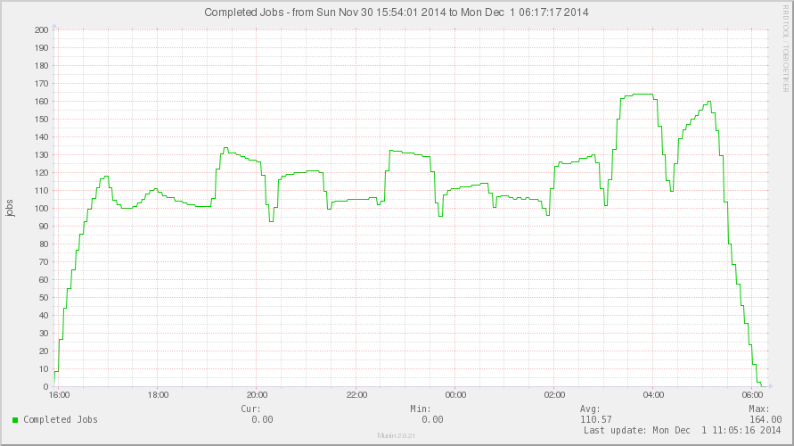
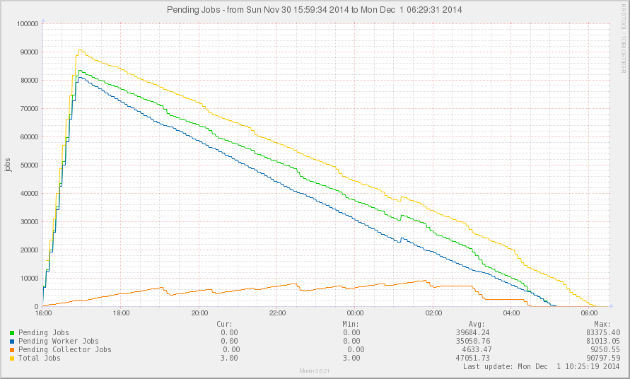

:tocdepth: 2

.. _architecture-and-design:

=======================
Architecture and Design
=======================

Bonnie receives and parses :term:`event notifications` issued by Cyrus
IMAP 2.5.

An event notification is issued when a user logs on or off, and when a
user makes a change to a mailbox or message.

These event notifications are used to build the data sets for each of
the following features included with Bonnie;

    *   :ref:`about-archival`

    *   :ref:`about-backup-and-restore`

    *   :ref:`about-e-discovery`

    *   :ref:`about-data-loss-prevention`

These features are (each of them) optional, in that a deployment used
solely for e-Discovery does not imply the inclusion of the other
features, and most feature descriptions use super-nomenclature for
otherwise limited, self-contained facilities that tend to serve a more
narrow purpose.

One example is a ``changelog`` module, which can be used to preserve
selected subsets of data, such as "who changed what in an event". This
particular module would fall under the category of e-Discovery, but not
include the full feature-set of e-Discovery.

.. rubric:: Technology Base

The initial design of Bonnie is created with the following technologies
as the basis:

    *   Elasticsearch
    *   ZeroMQ

The functional components that make up a complete Bonnie environment are
designed to be pluggable such that one or more extensions can be used
for either of the following channels:

**input**

    Used to receive new event notifications, or jobs, to be handled.

**storage**

    Used to store event notifications, queues and/or metadata.

**output**

    The final and persistent record(s) of state.

To parse information in to useful, digestible chunks, Bonnie uses
so-called *handlers*, that subscribe to event notifications using
*interests*.

For example, a *Logout* event is only stored to the output channel,
should a corresponding *Login* event be available. After all, there must
not be a *Logout* event without a *Login* event also having occurred.

A handler interested in the *Logout* event uses the storage channel to
determine the corresponding *Login* event is indeed available.

This storage channel may be configured to be an intermediate buffer,
that holds all *Login* events until after the corresponding *Logout*
event notification is received, or a timeout occurs, or may be
configured to be the same channel as the output channel.

Overview of Components
======================

The Bonnie infrastructure components are an add-on to an existing Cyrus
IMAP environment, typically as part of a `Kolab Groupware`_ deployment.

More detailed diagrams of communication flows in a standard Kolab
Groupware environment are available in the
`Kolab Groupware documentation`_, and are outside of the scope of the
design documentation for Bonnie. Suffice it to say, that Kolab Groupware
components communicate with Cyrus IMAP:

.. graphviz::

    digraph {
            rankdir = LR;
            splines = true;
            overlab = prism;
            fontname = Calibri;

            edge [color=gray50, fontname=Calibri, fontsize=11];
            node [shape=record, fontname=Calibri, fontsize=11];

            "Kolab Groupware";

            "Cyrus IMAP";

            "Kolab Groupware" -> "Cyrus IMAP" [dir=both];

        }

As Bonnie is added on top of this (existing) infrastructure the design
overview for the infrastructure becomes:

.. graphviz::

    digraph {
            rankdir = LR;
            splines = true;
            overlab = prism;
            fontname = Calibri;

            edge [color=gray50, fontname=Calibri, fontsize=11];
            node [shape=record, fontname=Calibri, fontsize=11];

            "Kolab Groupware" [color=gray50,style=filled];

            subgraph cluster_bonnie {
                    label = "Bonnie Infrastructure";

                    "Broker";

                    subgraph cluster_imap {
                            label = "IMAP Server";

                            "Cyrus IMAP" [color=gray50,style=filled];

                            "Collector";
                            "Dealer";
                        }

                    "Worker";
                }

            "Kolab Groupware" -> "Cyrus IMAP" [dir=both];

            "Cyrus IMAP" -> "Dealer";

            "Dealer" -> "Broker";

            "Broker" -> "Worker" [dir=both];

            "Collector" -> "Broker" [dir=both];

            "Worker" -> "Storage" [dir=both];

        }

The **Dealer** Component
========================

A dealer is a script executed once for each event notification, and is
used to dispatch the event notification as fast and as efficient as
possible.

.. graphviz::

    digraph {
            rankdir = LR;
            splines = true;
            overlab = prism;
            fontname = Calibri;

            edge [color=gray50, fontname=Calibri, fontsize=11];
            node [shape=record, fontname=Calibri, fontsize=11];

            "Kolab Groupware" [color=gray50,style=filled];

            subgraph cluster_bonnie {
                    label = "Bonnie Infrastructure";

                    "Broker";

                    subgraph cluster_imap {
                            label = "IMAP Server";

                            "Cyrus IMAP" [color=gray50,style=filled];

                            "Collector";
                            "Dealer" [color="green",style=filled];
                        }

                    "Worker";
                }

            "Kolab Groupware" -> "Cyrus IMAP" [dir=both];

            "Cyrus IMAP" -> "Dealer";

            "Dealer" -> "Broker";

            "Broker" -> "Worker" [dir=both];

            "Collector" -> "Broker" [dir=both];

            "Worker" -> "Storage" [dir=both];

        }

The Cyrus IMAP server's notification daemon :manpage:`notifyd(1)`
awaits the successful exit return code of the dealer script.

Should the dealer script not complete in a timely fashion and take
longer than anticipated, the Cyrus IMAP server will get congested and
ultimately freeze.

The default Bonnie dealer is made to fork to the background allowing the
Cyrus IMAP server to continue without congestion. Using this
asynchronous dealer counts toward the maximum number of processes.

A synchronous dealer is also available, that does not fork to the
background.

The dealer script uses ``stdin`` for input, can be configured to use one
or more storage data channels, and is configured to use one or more
output channels such as ``file`` or ``zmq``.

If applicable to the particular output channel used, in order to
guarantee the delivery of the event notification, the dealer awaits
confirmation of the event notification having been received.

Supported Channels
------------------

Currently supported input channels:

    *   ``sys.stdin``

        .. versionadded:: 0.1.0

Currently supported storage channels:

    None

Currently supported output channels:

    *   File

        Recommended only for troubleshooting and development.

        .. versionadded:: 0.2.0

    *   ZeroMQ

        .. versionadded:: 0.1.0

Component Design Diagram
------------------------

.. graphviz::

    digraph dealer {
            rankdir = LR;
            splines = true;
            overlab = prism;
            fontname = Calibri;

            edge [color=gray50, fontname=Calibri, fontsize=11];
            node [shape=record, fontname=Calibri, fontsize=11];

            "input" -> "dealer" [label="(1)"];

            "dealer" -> "dealer (fork)" [label="(2)"];

            "dealer" -> "input" [label="return (3)"];

            "dealer (fork)" -> "file output", "zmq output" [label="(4)",style=dotted,color=gray50];
        }

.. IMPORTANT::

    The size of the datagram used to send event notifications to
    :manpage:`notifyd(1)` is limited to 8192 bytes, too small for
    complete message contents.

.. NOTE::

    While the dealer could be supplied with intelligence to retrieve
    message contents, entertain handlers, and connect to output channels
    directly, ...

.. TODO::

    A storage layer implementation for the dealer should allow a maximum
    number of retries on the output channel, each of them failing, to
    form a local buffer allowing the dealer to fail to deliver its event
    notifications.

.. TODO::

    The :manpage:`notifyd(8)` daemon could be made to issue event
    notifications on to a ZeroMQ message bus directly.

    .. seealso::

        *   :bugzilla:`4000`

The **Broker** Component
========================

A broker receives the event notifications -- and, if appropriate,
acknowledges their receipt -- before dispatching them in (generally) the
right direction.

.. graphviz::

    digraph {
            rankdir = LR;
            splines = true;
            overlab = prism;
            fontname = Calibri;

            edge [color=gray50, fontname=Calibri, fontsize=11];
            node [shape=record, fontname=Calibri, fontsize=11];

            "Kolab Groupware" [color=gray50,style=filled];

            subgraph cluster_bonnie {
                    label = "Bonnie Infrastructure";

                    "Broker";

                    subgraph cluster_imap {
                            label = "IMAP Server";

                            "Cyrus IMAP" [color=gray50,style=filled];

                            "Collector";
                            "Dealer";
                        }

                    "Worker";
                }

            "Kolab Groupware" -> "Cyrus IMAP" [dir=both];

            "Cyrus IMAP" -> "Dealer";

            "Broker" [color="green",style=filled];

            "Dealer" -> "Broker";

            "Broker" -> "Worker" [dir=both];

            "Collector" -> "Broker" [dir=both];

            "Worker" -> "Storage" [dir=both];

        }

We say "generally the right direction", because the broker does not hold
any processing intelligence, and as such it can only make routing
decisions based on configured rules -- not necessarily the most
appropriate, but conform a predictable process.

One reason for the broker not holding any intelligence is that it must
maintain a level of responsiveness in order for the dealer (for example)
to receive its acknowledgements in a timely fashion.

There is always a chance of processing of intelligence in program
routines becoming overly burdensome compared to other tasks the program
may also need to fulfill. Hence, the broker is a broker, and just that.

Bonnie uses :ref:`architecture-and-design-the-worker-component` to hold
the intelligence needed to fulfill functional requirements.

The broker too uses one or more input modules to receive event
notifications, maintains persistent queues in one or more configured
storage channels, and dispatches event notifications over configured
output channels.

Supported Channels
------------------

Supported input channels include:

    *   ZeroMQ

        .. versionadded:: 0.2.3

Supported storage channels include:

    *   Databases supported by SQLAlchemy 0.8.0

        .. versionadded:: 0.2.3

Supported output channels include:

    *   ZeroMQ

        .. versionadded:: 0.2.3

Component Design Diagram
------------------------

The overview of input, storage and output channels is quite standard
from the perspective of the broker component:

.. graphviz::

    digraph broker {
            rankdir = LR;
            splines = true;
            overlab = prism;
            fontname = Calibri;

            edge [color=gray50, fontname=Calibri, fontsize=11];
            node [shape=record, fontname=Calibri, fontsize=11];

            "input" -> "input router" [label="(2)"];

            "input router" -> "storage" [label="(3)"];

            "input" -> "input router" [dir=back,label="(4)"];

            "storage" -> "output router" [label="(5)"];

            "output router" -> "output" [label="(6)"];
        }

Note that path from the original input to the job queue is largely a
one-way street, with exception of the receipt confirmation.

Zooming in to provide a little more detail when the broker uses ZeroMQ:

.. graphviz::

    digraph broker {
            rankdir = LR;
            splines = true;
            overlab = prism;
            fontname = Calibri;

            edge [color=gray50, fontname=Calibri, fontsize=11];
            node [shape=record, fontname=Calibri, fontsize=11];

            "input" -> "dealer" [label="(1)"];
            "dealer" -> "dealer router" [label="(2)"];

            subgraph cluster_broker {
                    label = "Broker";
                    color = gray90;
                    style = filled;

                    "dealer router";
                    "job queue";
                    "worker controller router";
                    "worker router";
                    "dot1" [style=dot,color=gray90,fontcolor=gray90];
                    "dot2" [style=dot,color=gray90,fontcolor=gray90];
                }

            "dealer router" -> "job queue" [label="(3)"];
            "dealer" -> "dealer router" [dir=back,label="(4)"];
            "worker controller router" -> "worker" [dir=back,label="(5)"];
            "job queue" -> "worker controller router" [dir=back,label="(6)"];
            "job queue" -> "worker controller router" [label="(7)"];
            "worker controller router" -> "worker" [label="(8)"];
            "dot1" -> "dot2" -> "worker router" [dir=none,color=gray90];
            "worker router" -> "worker" [dir=back,label="(9)"];
            "worker router" -> "worker" [label="(10)"];
            "worker controller router" -> "worker" [dir=back,label="(11)"];
            "job queue" -> "worker controller router" [dir=back,label="(12)"];
        }

Because of the size of the original event notification datagram,
additional information may need to be fetched. This information
typically includes information available only on the original source of
the event notification, such as message payload.

.. graphviz::

    digraph broker {
            rankdir = LR;
            splines = true;
            overlab = prism;
            fontname = Calibri;

            edge [color=gray50, fontname=Calibri, fontsize=11];
            node [shape=record, fontname=Calibri, fontsize=11];

            subgraph cluster_broker {
                    label = "Broker";
                    color = gray90;
                    style = filled;

                    "dealer router";
                    "job queue";
                    "worker controller router";
                    "worker router";
                    "collector router";
                    "dot1" [style=dot,color=gray90,fontcolor=gray90];
                    "dot2" [style=dot,color=gray90,fontcolor=gray90];
                }

            "input" -> "dealer" [label="(1)"];
            "dealer" -> "dealer router" [label="(2)"];
            "dealer router" -> "job queue" [label="(3)"];
            "dealer" -> "dealer router" [dir=back,label="(4)"];
            "worker controller router" -> "worker" [dir=back,label="(5)"];
            "job queue" -> "worker controller router" [dir=back,label="(6)"];
            "job queue" -> "worker controller router" [label="(7)"];
            "worker controller router" -> "worker" [label="(8)"];
            "dot1" -> "dot2" -> "worker router" [dir=none,color=gray90];
            "worker router" -> "worker" [dir=back,label="(9)"];
            "worker router" -> "worker" [label="(10)"];
            "worker controller router" -> "worker" [dir=back,label="(11)"];
            "job queue" -> "worker controller router" [dir=back,label="(12)"];
            "collector" -> "collector router" [label="(13)"];
            "collector router" -> "job queue" [label="(14)"];
            "collector router" -> "job queue" [dir=back,label="(15)"];
            "collector" -> "collector router" [dir=back,label="(16)"];
            "collector" -> "collector router" [label="(17)"];
            "collector router" -> "job queue" [label="(18)"];
        }

.. _architecture-and-design-the-worker-component:

The **Worker** Component
========================

The Bonnie worker is where the processing happens -- one can have as
many workers as necessary, or as few as required.

.. graphviz::

    digraph {
            rankdir = LR;
            splines = true;
            overlab = prism;
            fontname = Calibri;

            edge [color=gray50, fontname=Calibri, fontsize=11];
            node [shape=record, fontname=Calibri, fontsize=11];

            "Kolab Groupware" [color=gray50,style=filled];

            subgraph cluster_bonnie {
                    label = "Bonnie Infrastructure";

                    "Broker";

                    subgraph cluster_imap {
                            label = "IMAP Server";

                            "Cyrus IMAP" [color=gray50,style=filled];

                            "Collector";
                            "Dealer";
                        }

                    "Worker" [color="green",style=filled];
                }

            "Kolab Groupware" -> "Cyrus IMAP" [dir=both];
            "Cyrus IMAP" -> "Dealer";
            "Broker";
            "Dealer" -> "Broker";
            "Broker" -> "Worker" [dir=both];
            "Collector" -> "Broker" [dir=both];
            "Worker" -> "Storage" [dir=both];
        }

The worker periodically announces its presence and state to the broker,
which subsequently assigns jobs to the worker. The exchange of worker
status and broker assigment messages occurs over a separate *controller*
channel to allow a worker to take as much time as it needs to complete
the necessary routines.

.. graphviz::

    digraph broker {
            rankdir = LR;
            splines = true;
            overlab = prism;
            fontname = Calibri;

            edge [color=gray50, fontname=Calibri, fontsize=11];
            node [shape=record, fontname=Calibri, fontsize=11];

            subgraph cluster_broker {
                    label = "Broker";
                    color = gray90;
                    style = filled;

                    "job queue";
                    "worker controller router";
                    "worker router";
                    "dot2" [style=dot,color=gray90,fontcolor=gray90];
                }

            "worker controller router" -> "worker" [dir=back,label="(5)"];
            "job queue" -> "worker controller router" [dir=back,label="(6)"];
            "job queue" -> "worker controller router" [label="(7)"];
            "worker controller router" -> "worker" [label="(8)"];
            "dot2" -> "worker router" [dir=none,color=gray90];
            "worker router" -> "worker" [dir=back,label="(9)"];
            "worker router" -> "worker" [label="(10)"];
            "worker controller router" -> "worker" [dir=back,label="(11)"];
            "job queue" -> "worker controller router" [dir=back,label="(12)"];
        }

The worker may require additional information to be obtained, such
as the message payload [#]_.

Component Design Diagram
------------------------

.. graphviz::

    digraph broker {
            rankdir = LR;
            splines = true;
            overlab = prism;
            fontname = Calibri;

            edge [color=gray50, fontname=Calibri, fontsize=11];
            node [shape=record, fontname=Calibri, fontsize=11];

            subgraph cluster_input {
                    label = "input";
                    color = gray90;
                    style = filled;

                    "job queue";
                    "worker controller router";
                    "worker router";
                    "job queue" -> "worker controller router" [color=gray90,dir=none];
                    "job queue" -> "worker router" [color=gray90,dir=none];

            }

            subgraph cluster_worker {
                    label = "worker";
                    color = gray90;
                    style = filled;

                    "worker controller dealer";
                    "worker dealer";
            }

            "worker controller router" -> "worker controller dealer" [label="(8)"];
            "worker controller dealer" -> "worker controller router" [label="(11)"];
            "worker router" -> "worker dealer" [label="(10)"];
            "worker router" -> "worker dealer" [dir=back,label="(11)"];
            "worker dealer" -> "worker dealer" [label="(12)"];
            "worker dealer" -> "storage" [label="(13)"];
        }

The **Collector** Component
===========================

    The collector daemon is an optional component subscribing to
    requests for additional information that can only reliably be
    obtained from a Cyrus IMAP backend spool directory.

**System Log Centralization**

    The centralization of system log files such as
    :file:`/var/log/maillog` aids in tracing the exchange of messages as
    they descend across infrastructure, and helps in associating, for
    example, a Login event to an IMAP frontend with the corresponding
    web server session [#]_.

.. _architecture-and-design-figure-bonnie-jobs-done:

    Figure #1: Jobs processed per minute

:ref:`architecture-and-design-figure-jobs-pending` graphs approximately
90.000 email being delivered approximately 30.000 users and shows, in
order of appearance;

*16:00 - 17:00*

    Initial submission of new event notifications at a rate of
    approximately 25 event notifications per second.

*16:00 - 17:00*

    As soon as the first few event notifications are received, the
    broker starts dispatching jobs to workers. Initially, all jobs are
    worker jobs.

    Workers may conclude extra information is needed, and cause the job
    to subsequently be dispatched to collectors.

    :ref:`architecture-and-design-figure-jobs-pending` clearly shows
    divergence of the total number of jobs (yellow) and the number of
    worker jobs in state pending (blue). It also shows the number of
    collectors jobs rising (orange).

    .. NOTE::

        The broker may allocate more jobs to workers than there are
        workers available (see :bugzilla:`4000`).

    .. NOTE::

        The broker considers the collectors are single-threaded, while
        in fact they may be multi-threaded (see :bugzilla:`4000`).

    .. NOTE::

        The collector jobs likely lag behind worker jobs being
        reassigned, because the broker intentionally dispatches worker
        jobs before collector jobs.

*17:00*

    No more or few inbound event notifications. Collectors have started
    to process, workers are starting to process jobs with complete data-
    sets.

*19:00 - 19:30*

    Collector's processing of jobs surges (orange),

    Number of pending jobs decreases (green),

    Number of worker jobs stagnates (blue, collector jobs are updated to
    become worker jobs),

*01:00 - 01:30*

    A new email is submitted to approximately 2200 recipients,
    triggering new event notifications.

*04:30*

    Processing of collector jobs is completed, the remainder of pending
    jobs is now equal to the remainder of pending worker jobs.

*05:00 - 06:00*

    The remainder of worker jobs over-allocated are unlocked and
    processed.

.. _architecture-and-design-figure-jobs-pending:

    Figure #2: Job Queue Statistics

Bonnie Design
=============

The Bonnie infrastructure components are an add-on to an existing Kolab
Groupware environment, where Kolab communicates with Cyrus IMAP. More
detailed diagrams of communication flows in a standard Kolab Groupware
environment are available elsewhere in the documentation, and are
outside of the scope of the functional design for Bonnie.

.. graphviz::

    digraph {
            rankdir = LR;
            splines = true;
            overlab = prism;

            edge [color=gray50, fontname=Calibri, fontsize=11];
            node [shape=record, fontname=Calibri, fontsize=11];

            "Kolab Groupware";

            "Cyrus IMAP";

            "Kolab Groupware" -> "Cyrus IMAP" [dir=both,label="(1)"];

        }

As Bonnie is added on top of this (existing) infrastructure, and with
Cyrus IMAP 2.5 event notification features enabled, the functional
design for the infrastructure becomes:

.. graphviz::

    digraph {
            rankdir = LR;
            splines = true;
            overlab = prism;

            edge [color=gray50, fontname=Calibri, fontsize=11];
            node [shape=record, fontname=Calibri, fontsize=11];

            "Kolab Groupware" [color=gray50,style=filled];

            subgraph cluster_bonnie {
                    label = "Bonnie Infrastructure";

                    "Broker";

                    subgraph cluster_imap {
                            label = "IMAP Server";

                            "Cyrus IMAP" [color=gray50,style=filled];

                            "Collector";
                            "Dealer";
                        }

                    "Worker";
                }

            "Kolab Groupware" -> "Cyrus IMAP" [dir=both,label="(1)"];

            "Cyrus IMAP" -> "Dealer" [label="(2)"];

            "Dealer" -> "Broker" [label="(3)"];

            "Broker" -> "Worker" [label="(4)"];

            "Broker" -> "Worker" [dir=back,label="(4a)"];

            "Collector" -> "Broker" [dir=back,label="(4b)"];
            "Collector" -> "Broker" [label="(4c)"];

            "Worker" -> "Storage" [dir=both,label="(5)"];

        }

This process involves the following steps:

1.  Kolab Groupware continues to communicate with Cyrus IMAP directly.

2.  For changes to content in Cyrus IMAP, and other events worth
    maintaining a record of, Cyrus IMAP issues an event notification
    [#]_.

3.  A *dealer* dispatches the event notification to a central *broker*
    as fast as possible, and unlocks the Cyrus IMAP processes as quickly
    as possible [#]_.

4.  The *broker* maintains a queue of event notifications that are
    picked off the queue by *worker* processes one-by-one.

    a.  Should the *worker* declare an interest [#]_ in data not
        included in the original event notification [#]_, then the event
        notification is sent back to the *broker* for re-evaluation.

    b.  Re-evaluation currently includes contacting a *collector* that
        runs on the Cyrus IMAP server that issued the original event
        notification [#]_.

    c.  An amended event notification (with additional data) is sent
        back to the *broker*.

5.  After the *worker* evaluates the new event notification [#]_, it
    stores the event in storage [#]_.

ZeroMQ Communication Model
==========================

The Bonnie source code allows the technology used to communicate between
components to be easily substituted.

For the initial development phase the communications between Bonnie
components is based on ZeroMQ (0MQ).

Specifically to this message bus technology, the communication model is
evaluated to address access and directionality concerns:

.. graphviz::

    digraph {
            rankdir = LR;
            splines = true;
            overlab = prism;

            edge [color=gray50, fontname=Calibri, fontsize=11];
            node [shape=record, fontname=Calibri, fontsize=11];

            subgraph cluster_broker {
                    label="broker";

                    "\*:5570" -> "dealer_router" -> "queue";
                    "\*:5571" -> "collector_router" -> "queue";
                    "queue" -> "controller_router" -> "\*:5572";
                    "queue" -> "worker_router" -> "\*:5573";
                }

            subgraph cluster_worker {
                    label="worker";

                    "worker";
                    "controller";
                }

            subgraph cluster_imap {
                    label="imap server";
                    "collector";
                    "dealer";
                }

            "collector" -> "\*:5571";
            "dealer" -> "\*:5570";
            "\*:5572" -> "controller" [dir=back];
            "\*:5573" -> "worker" [dir=back];

            "worker" -> "storage";
        }

.. _and-bonnie-broker-worker-interaction:

Broker -- Worker Interaction
============================

When the broker starts up, it creates three listener sockets:

#.  A dealer router,

    used for incoming event notifications from IMAP servers passed through the Dealer component.

#.  A worker router,

    used to exchange job information and notification payload with workers.

#.  A control router,

    used to exchange worker and job state information.

When the worker starts, it connects to both the control router and
worker router.

#.  Using the controller channel, the worker let's the broker know it is
    ready to receive a job.

    .. graphviz::

        digraph {
                rankdir = LR;
                splines = true;
                overlab = prism;

                edge [color=gray50, fontname=Calibri, fontsize=11];
                node [shape=record, fontname=Calibri, fontsize=11];

                "broker" -> "worker" [label="READY",dir=back];
            }

    *   The broker adds the worker to its list of workers.

    *   The broker will continue to receive occasional messages from the
        worker to allow it to determine whether or not it is still
        available.

#.  The broker, maintaining a queue of jobs to assign to workers, lets
    the worker know about a newly assigned job -- again using the controller channel.

    .. graphviz::

        digraph {
                rankdir = LR;
                splines = true;
                overlab = prism;

                edge [color=gray50, fontname=Calibri, fontsize=11];
                node [shape=record, fontname=Calibri, fontsize=11];

                "broker" -> "worker" [label="TAKE $ID"];
            }

#.  The worker internally triggers the retrieval of the job using the
    worker channel.

    .. graphviz::

        digraph {
                rankdir = LR;
                splines = true;
                overlab = prism;

                edge [color=gray50, fontname=Calibri, fontsize=11];
                node [shape=record, fontname=Calibri, fontsize=11];

                "broker" -> "worker" [label="GET $ID",dir=back];
                "broker" -> "worker" [label="JOB $ID $PAYLOAD"];
            }

#.  The worker is now in state BUSY and must respond within a set
    interval or the broker will set the job back in to PENDING state,
    and mark the worker as unavailable.

.. _and-bonnie-worker-design:

Worker Design
=============

The worker is built out of plugins, that subscribe to an event type,
where event types available are listed in
:ref:`and-bonnie-event-notification-types`.

Each event type individually may require handling -- for example, a
logout event is associated with the corresponding login event.

The following components will be pluggable and configurable:

*   subscribing to a message bus or queue, as ``inputs``, initially
    including only ``zmq``.

*   event handling, as ``handlers``, initially including only one
    handler per event notification and higher level processors
    ``changelog`` and ``freebusy`` to detect changes in groupwware
    objects.

*   result output, as ``output``, initially including only
    ``elasticsearch``.

*   storage for transactions pending or aggregated meta information,
    as ``storage``, initialy including only ``elasticsearch``.

Assuming an installation path of :file:`bonnie/worker/`, the following
depicts its tree layout:

.. parsed-literal::

    handlers/
        `-  changelog.py
        `-  freebusy.py
        `-  mailboxcreate.py
        `-  messageappend.py
        `-  ...
    inputs/
        `-  zmq_input.py
    outputs/
        `-  elasticsearch_output.py
    storage/
        `-  elasticsearch_storage.py

To take the changelog and freebusy handlers as an example, the following
event notification types may need to be subscribed to.

:ref:`and-bonnie-event-mailboxcreate`

    A new mailbox that is an event folder may have been created.

    The initial event is handled by the base handler for the event
    notification type.

    Passing this event right through to the changelog handler would make
    it require obtaining the ``/shared/vendor/kolab/folder-type`` and/or
    ``/private/vendor/kolab/folder-type`` metadata value(s) in order to
    determine whether the folder indeed is an event folder.

    However, the setting of metadata is an event separate from the
    mailbox creation, and at the moment the handler receives the initial
    event notification, the metadata may not have been set yet.

    .. NOTE::

        At the time of this writing, no separate event notification for
        setting folder-level METADATA exists.

:ref:`and-bonnie-event-mailboxdelete`

    A mailbox that was an event folder may have been deleted.

:ref:`and-bonnie-event-mailboxrename`

    A mailbox that was an event folder may have been renamed.

:ref:`and-bonnie-event-messageappend`

    Only applicable to event folders, this depicts a new or updated
    version of an existing event has been appended.

:ref:`and-bonnie-event-messagecopy`

    One or more events may have been copied from an event folder into
    another event folder.

:ref:`and-bonnie-event-messagemove`

    One or more events may have been moved from one event folder into
    another event folder.

.. NOTE::

    Plugins that are interested in the vendor/kolab/folder-type METADATA
    value(s) of a folder can reply with additional commands for the collector
    component which will put the current job back into the PENDING state and
    send it through the handler again once the requested information was added
    to the notification payload.

.. _and-bonnie-event-notification-types:

Event Notification Types
========================

Event types available include, in alphabetical order:

#.  :ref:`and-bonnie-event-flagsclear`
#.  :ref:`and-bonnie-event-flagsset`
#.  :ref:`and-bonnie-event-login`
#.  :ref:`and-bonnie-event-logout`
#.  :ref:`and-bonnie-event-mailboxcreate`
#.  :ref:`and-bonnie-event-mailboxdelete`
#.  :ref:`and-bonnie-event-mailboxrename`
#.  :ref:`and-bonnie-event-mailboxsubscribe`
#.  :ref:`and-bonnie-event-mailboxunsubscribe`
#.  :ref:`and-bonnie-event-messageappend`
#.  :ref:`and-bonnie-event-messagecopy`
#.  :ref:`and-bonnie-event-messageexpire`
#.  :ref:`and-bonnie-event-messageexpunge`
#.  :ref:`and-bonnie-event-messagemove`
#.  :ref:`and-bonnie-event-messagenew`
#.  :ref:`and-bonnie-event-messageread`
#.  :ref:`and-bonnie-event-messagetrash`
#.  :ref:`and-bonnie-event-quotaexceeded`
#.  :ref:`and-bonnie-event-quotawithin`
#.  :ref:`and-bonnie-event-quotachange`

.. _and-bonnie-event-flagsclear:

FlagsClear
----------

This event notification type indicates one or more messages have had its
flags cleared.

Flags having been cleared may include ``\Seen``, but also ``\Deleted``,
and any custom other flag on an IMAP message.

Subscribe to this notification for:

*   Backup/Restore
*   e-Discovery

.. _and-bonnie-event-flagsset:

FlagsSet
--------

Subscribe to this notification for:

*   Backup/Restore
*   e-Discovery

.. _and-bonnie-event-login:

Login
-----

Additional information to obtain for this event notification type:

*   The persistent unique attribute for the user object.
*   Additional LDAP object attributes.

Information storage:

*   This event needs to be stored until it can be associated with a
    :ref:`and-bonnie-event-logout` event notification type.

Subscribe to this notification for:

*   e-Discovery

.. _and-bonnie-event-logout:

Logout
------

Subscribe to this notification for:

*   e-Discovery

.. _and-bonnie-event-mailboxcreate:

MailboxCreate
-------------

Additional information to obtain

.. _and-bonnie-event-mailboxdelete:

MailboxDelete
-------------

.. _and-bonnie-event-mailboxrename:

MailboxRename
-------------

.. _and-bonnie-event-mailboxsubscribe:

MailboxSubscribe
----------------

.. _and-bonnie-event-mailboxunsubscribe:

MailboxUnsubscribe
------------------

.. _and-bonnie-event-messageappend:

MessageAppend
-------------

.. _and-bonnie-event-messagecopy:

MessageCopy
-----------

.. _and-bonnie-event-messageexpire:

MessageExpire
-------------

.. _and-bonnie-event-messageexpunge:

MessageExpunge
--------------

.. _and-bonnie-event-messagemove:

MessageMove
-----------

.. _and-bonnie-event-messagenew:

MessageNew
----------

.. _and-bonnie-event-messageread:

MessageRead
-----------

.. _and-bonnie-event-messagetrash:

MessageTrash
------------

.. _and-bonnie-event-quotaexceeded:

QuotaExceeded
-------------

.. _and-bonnie-event-quotawithin:

QuotaWithin
-----------

.. _and-bonnie-event-quotachange:

QuotaChange
-----------

An Integrated Solution
======================

The following aspects of an environment need to be tracked;

*   Logs such as ``/var/log/maillog``, which contain the information
    about exchange of messages between internal and external systems and
    software (Postfix/LMTP -> Cyrus IMAP).

*   Cyrus IMAP 2.5 Events broadcasted.

.. graphviz::

    digraph {
            subgraph cluster_imap {
                    width = 7.0;
                    "IMAP #" [shape=rectangle];
                    "IMAP 2" [shape=rectangle];
                    "IMAP 1" [shape=rectangle];
                }

            "Message Bus" [shape=rectangle,width=7.0];

            "IMAP #" -> "Message Bus";
            "IMAP 2" -> "Message Bus";
            "IMAP 1" -> "Message Bus";

            subgraph cluster_subscribers {
                    width = 7.0;
                    "Archival" [shape=rectangle];
                    "Backup" [shape=rectangle];
                    "Data-Loss Prevention" [shape=rectangle];
                    "e-Discovery" [shape=rectangle];
                }

            "Message Bus" -> "Archival";
            "Message Bus" -> "Backup";
            "Message Bus" -> "Data-Loss Prevention";
            "Message Bus" -> "e-Discovery";

            "NoSQL Storage" [shape=rectangle,width=3.0];
            "SQL Storage" [shape=rectangle,width=3.0];

            "Archival", "Backup", "Data-Loss Prevention", "e-Discovery" -> "NoSQL Storage", "SQL Storage";
        }

In this picture, IMAP (using Cyrus IMAP 2.5) issues so-called
:term:`event notifications` to a message bus, that can be picked up by the
appropriate subscribers.

Note that the subscribers are different components to plug in and enable, or
leave out -- not everyone has a need for Archival and e-Discovery capabilities.

As such, a component plugged in could announce its presence, and start working
backwards as well as start collecting the relevant subsets of data in a retro-
active manner.

.. graphviz::

    digraph event_notification {
            rankdir = LR;
            splines = true;
            overlab = prism;

            edge [color=gray50, fontname=Calibri, fontsize=11];
            node [shape=record, fontname=Calibri, fontsize=11];

            "subscriber";
            "message bus" [height=2.0];
            "daemon";
            "publisher";

            "subscriber" -> "message bus" [label="announces presence"];
            "daemon" -> "message bus" [label="presence announcement", dir=back];
            "daemon" -> "message bus" [label="works backwards"];
            "publisher" -> "message bus" [label="event notifications"];

        }

To allow scaling, the intermediate medium is likely a message bus such
as ActiveMQ, AMQP, ZeroMQ, etc.

Between Cyrus IMAP 2.5 and the message bus must be a thin application
that is capable of:

*   Retrieving the payload of the message(s) involved if necessary,
*   Submit the remainder to a message bus.

This is because Cyrus IMAP 2.5:

#.  at the time of this writing, does not support submitting the event
    notifications to a message bus directly [#]_,

#.  the size of the message payload is likely to exceed the maximum size of an
    event notification datagram [#]_.

Processing of inbound messages must happen real-time or near-time, but should
also be post-processed:

*   e-Discovery requires post-processing to sufficiently associate the message
    in its context, and contains an audit trail.

*   Archival and Backup require payload, and may also use post-processing to
    facilitate Restore.

Event Notifications
===================

The following events trigger notifications:

.. code-block:: c

    /*
    * event types defined in RFC 5423 - Internet Message Store Events
    */
    enum event_type {
        EVENT_CANCELLED           = (0),
        /* Message Addition and Deletion */
        EVENT_MESSAGE_APPEND      = (1<<0),
        EVENT_MESSAGE_EXPIRE      = (1<<1),
        EVENT_MESSAGE_EXPUNGE     = (1<<2),
        EVENT_MESSAGE_NEW         = (1<<3),
        EVENT_MESSAGE_COPY        = (1<<4), /* additional event type to notify IMAP COPY */
        EVENT_MESSAGE_MOVE        = (1<<5), /* additional event type to notify IMAP MOVE */
        EVENT_QUOTA_EXCEED        = (1<<6),
        EVENT_QUOTA_WITHIN        = (1<<7),
        EVENT_QUOTA_CHANGE        = (1<<8),
        /* Message Flags */
        EVENT_MESSAGE_READ        = (1<<9),
        EVENT_MESSAGE_TRASH       = (1<<10),
        EVENT_FLAGS_SET           = (1<<11),
        EVENT_FLAGS_CLEAR         = (1<<12),
        /* Access Accounting */
        EVENT_LOGIN               = (1<<13),
        EVENT_LOGOUT              = (1<<14),
        /* Mailbox Management */
        EVENT_MAILBOX_CREATE      = (1<<15),
        EVENT_MAILBOX_DELETE      = (1<<16),
        EVENT_MAILBOX_RENAME      = (1<<17),
        EVENT_MAILBOX_SUBSCRIBE   = (1<<18),
        EVENT_MAILBOX_UNSUBSCRIBE = (1<<19)
    };

In addition, Kolab Groupware makes available the following event notifications:

.. code-block:: c

    enum event_type {
        (...)
        EVENT_MAILBOX_UNSUBSCRIBE = (1<<19),
        EVENT_ACL_CHANGE          = (1<<20)
    };

This means the following event notifications are lacking:

#.  METADATA change notification

It is possible to run Cyrus IMAP 2.5 notifications in a blocking fashion,
allowing the (post-)processing operation(s) to complete in full before the IMAP
session is allowed to continue / confirms the modification/mutation.

.. Removed ORM model description after moving to elasticsearch for storage
.. __ include:: bonnie-orm.rst

Queries and Information Distribution
====================================

ZeroMQ
======

.. graphviz::

    digraph bonnie_zeromq {
            splines = true;
            overlap = prism;

            edge [color=gray50, fontname=Calibri, fontsize=11]
            node [shape=record, fontname=Calibri, fontsize=11]

            subgraph cluster_broker {
                    label = "Broker";
                    "Client Router";
                    "Controller";
                    "Worker Router";
                }

            "Client-%d" -> "Client Router";
            "Worker-%d" -> "Worker Router";
            "Worker-%d" -> "Controller";
        }

Dealer <-> Broker <-> Worker Message Exchange
=============================================

Modelled after an article about tracking worker status at
http://rfc.zeromq.org/spec:14

.. graphviz::

    digraph bonnie_broker {
            rankdir = LR;
            splines = true;
            overlap = prism;

            edge [color=gray50, fontname=Calibri, fontsize=11]
            node [shape=record, fontname=Calibri, fontsize=11]

            subgraph cluster_broker {
                    label = "Broker";

                    "Dealer Router";
                    "Job Queue";
                }

            subgraph cluster_clients {
                    label = "Dealers";
                    "Dealer $x" [label="Dealer-%d"];
                    "Dealer $y" [label="Dealer-%d"];
                }

            "Dealer $x", "Dealer $y" -> "Dealer Router" [label="(1) Submit"];
            "Dealer Router" -> "Job Queue" [label="(2) Queue"];
            "Dealer $x", "Dealer $y" -> "Dealer Router" [label="(3) Acknowledge",dir=back];

        }

**Dealer - Broker Concerns**

    #.  The dealer is queuing without a high-water mark and without a local
        swap defined. It is only after the broker is available this queue is
        flushed. This could introduce a loss of notifications.

    #.  The dealer is not awaiting confirmation in the sense that it will replay
        the submission if needed, such as after the dealer has been restarted.
        This too could introduce a loss of notifications.

    #.  The dealer is certainly not awaiting confirmation from any worker that
        the notification had been submitted to for handling.

    #.  The dealer is a sub-process of the cyrus-imapd service, and should this
        service be restarted, is not handling such signals to preserve state.

**Broker Concerns**

    #.  The broker is keeping the job queue in memory for fast updates and responses.

    .. NOTE::
        The broker component shall periodically dump the job queue and registered
        worker and collector connections into a persistant storage layer which has yet
        to be defined.

.. graphviz::

    digraph bonnie_broker {
            rankdir = LR;
            splines = true;
            overlap = prism;

            edge [color=gray50, fontname=Calibri, fontsize=11]
            node [shape=record, fontname=Calibri, fontsize=11]

            subgraph cluster_broker {
                    label = "Broker";

                    "Controller";
                    "Job Queue";
                    "Worker Router";
                    "Worker List";
                }

            subgraph cluster_workers {
                    label = "Workers";
                    "Worker $x" [label="Worker-%d"];
                    "Worker $y" [label="Worker-%d"];
                }

            "Worker $x", "Worker $y" -> "Controller" [label="(a) READY"];

            "Controller" -> "Job Queue" [label="(b) Find Job"];
            "Controller" -> "Worker List" [label="(c) Find Worker"];
            "Controller" -> "Worker $x", "Worker $y" [label="(d) Assign Job"];

            "Worker $x", "Worker $y" -> "Worker Router" [label="(e) Take Job"];
            "Worker Router" -> "Worker List" [label="(f) Mark BUSY"];
        }

.. graphviz::

    digraph bonnie_broker {
            rankdir = LR;
            splines = true;
            overlap = prism;

            edge [color=gray50, fontname=Calibri, fontsize=11]
            node [shape=record, fontname=Calibri, fontsize=11]

            subgraph cluster_broker {
                    label = "Broker";

                    "Controller";
                    "Dealer Router";
                    "Job Queue";
                    "Worker Router";
                    "Worker List";
                }

            subgraph cluster_clients {
                    label = "Dealers";
                    "Dealer $x" [label="Dealer-%d"];
                    "Dealer $y" [label="Dealer-%d"];
                }

            subgraph cluster_workers {
                    label = "Workers";
                    "Worker $x" [label="Worker-%d"];
                    "Worker $y" [label="Worker-%d"];
                }

            "Dealer $x", "Dealer $y" -> "Dealer Router" [label="(1) Submit"];
            "Dealer Router" -> "Job Queue" [label="(2) Queue"];
            "Dealer $x", "Dealer $y" -> "Dealer Router" [label="(3) Acknowledge",dir=back];

            "Worker $x", "Worker $y" -> "Controller" [label="(a) READY"];

            "Controller" -> "Job Queue" [label="(b) Find Job"];
            "Controller" -> "Worker List" [label="(c) Find Worker"];
            "Controller" -> "Worker $x", "Worker $y" [label="(d) Assign Job"];

            "Worker $x", "Worker $y" -> "Worker Router" [label="(e) Take Job"];
            "Worker Router" -> "Worker List" [label="(f) Mark BUSY"];
        }

.. _and-bonnie-storage-layout-schema:

Storage Layout and Schema
=========================

Logging Event Notifications
---------------------------

Logging event notification into the storage backend (currently elasticsearch)
is inspired by logstash and writes to daily rotated indexes ``logstash-Y-m-d``
using document type ``logs``. The basic schema of an event notification
contains the following attributes:

.. code-block:: json

    {
      "@timestamp": "2014-10-11T23:10:20.536000Z",
      "@version": 1,
      "event": "SomeEvent",
      "client_ip": "::1",
      "folder_id": "4ed7903ebd7722d12596a2e2ed57bbdf",
      "folder_uniqueid": "f83c6305-f884-440a-b93d-eff285ada1f4",
      "service": "imap",
      "session_id": "kolab.example.org-2819-1413069020-1",
      "uri": "imap://john.doe@example.org@kolab.example.org/INBOX;UIDVALIDITY=1411487701",
      "user": "john.doe@example.org",
      "user_id": "f6c10801-1dd111b2-9d31a2a8-bebbcb98",
    }

The very minimal attributes required for an event notification entry are

*   ``@timestamp``: The UTC time when the event was logged
*   ``@version``: Bonnie data API version
*   ``event``: The Cyrus IMAP event
*   ``service``: "imap" denoting that this logstash entry represents an IMAP event notification
*   ``session_id``: The Cyrus IMAP session identifier
*   ``user``: The authenticated user who triggered the event

Depending on the event type, additional attributes containg message IDs, message
headers or payload, flag names or ACL. For message or mailbox based events the ``uri``
attribute is added and refers to the mailbox/folder the operation was executed on.

From the basic attributes, some relations to metadata (see :ref:`and-bonnie-storing-metadata`)
are extracted and the logstash entry is extended with identifiers referring to user
and folder metadata entries:

*   ``folder_uniqueid``: The gobally unique folder identifer of a mailbox folder from IMAP.

*   ``folder_id``: Links to a folder entry representing the current state of a mailbox folder
    at the time the event occurred. This includes folder name, metadata and access rights.

*   ``user_id``: Unique identifier (from the LDAP ``nsuniqueid`` attribute) of the
    use who executed the logged operation in IMAP.

.. _and-bonnie-storing-metadata:

Storing Metadata
----------------

Metadata records are used to amend log data with more complete and persistent
information of rather volatile attributes like username and mailbox URIs issued
by Cyrus IMAP 2.5 notifications. For example, the same physical human being
(jane.gi@example.org) could change email addresses for any of many unrelated
causes (jane.doe@example.org) and IMAP folders can be renamed at any given time.

Users
^^^^^

Stored in ``objects/user`` with the following schema:

.. code-block:: json

    {
      "@timestamp": "2014-10-11T19:30:24.330029Z",
      "dn": "uid=doe,ou=People,dc=example,dc=org",
      "user": "john.doe@example.org",
      "cn": "John Doe"
    }

The ``nsuniqueid`` attribute from the LDAP is used as the primary key/id
of user records.

Folders
^^^^^^^

Stored in ``objects/folder`` with the following schema:

.. code-block:: json

    {
      "@timestamp": "2014-10-11T23:10:54.055272Z",
      "@version": 1,
      "acl": {
        "anyone": "lrswiptedn",
        "f6c10801-1dd111b2-9d31a2a8-bebbcb98": "lrswipkxtecdan"
      },
      "metadata": {
        "/shared/vendor/cmu/cyrus-imapd/duplicatedeliver": "false",
        "/shared/vendor/cmu/cyrus-imapd/lastupdate": "12-Oct-2014 01:10:20 +0200",
        "/shared/vendor/cmu/cyrus-imapd/partition": "default",
        "/shared/vendor/cmu/cyrus-imapd/pop3newuidl": "true",
        "/shared/vendor/cmu/cyrus-imapd/sharedseen": "false",
        "/shared/vendor/cmu/cyrus-imapd/size": "2593",
        "/shared/vendor/cmu/cyrus-imapd/uniqueid": "f83c6305-f884-440a-b93d-eff285ada1f4",
        "/shared/vendor/kolab/folder-type": "mail"
      },
      "name": "INBOX",
      "owner": "john.doe",
      "server": "kolab.example.org",
      "type": "mail",
      "uniqueid": "f83c6305-f884-440a-b93d-eff285ada1f4",
      "uri": "imap://john.doe@example.org@kolab.example.org/INBOX"
    }

The primary key/id of folder records is computed as a checksum of all
attributes and metadata entries considered relevant for the "state" of
a folder. This means that a new folder record is created when ACLs or
folder type metadata is changed.

The keys of ``acl`` entries provided by the Collector module from IMAP data
are translated into static user identifers.

.. NOTE::

    In order to compute the folder identifier, the complete set of
    folder information like metadata and acl has to be pulled from
    IMAP using a collector job on every single event notification.
    Once Cyrus IMAP supports notifications for metadata changes
    (`#3698 <https://issues.kolab.org/show_bug.cgi?id=3698>`_),
    this could be skipped and the folder metadata records can be
    updated on specific events only.

Object Relations
----------------

Although elasticsearch isn't a relational database, the Bonnie storage model implies
a simple object relation model between logs and metadata.

.. graphviz::

    digraph bonnie_relations {
            splines = true;
            overlap = prism;

            edge [color=gray50, fontname=Calibri, fontsize=11]
            node [shape=record, fontname=Calibri, fontsize=11]

            subgraph cluster_user {
                    label = "User (objects/user)";
                    user_user_id [label="_id", color=blue, fontcolor=blue];
                    user_user_dn [label="dn", color=blue, fontcolor=blue];
                    user_user_cn [label="cn", color=blue, fontcolor=blue];
                }

            subgraph cluster_folder {
                    label = "Folder (objects/folder)";
                    folder_id [label="_id", color=blue, fontcolor=blue];
                    folder_uniqueid [label="uniqueid", color=blue, fontcolor=blue];
                }

            subgraph cluster_log {
                    label = "Log Entry (logstash-*/log)";
                    log_user [label="user", color=blue, fontcolor=blue];
                    log_uri [label="uri", color=blue, fontcolor=blue];
                    log_user_id [label="user_id", color=blue, fontcolor=blue];
                    log_folder_id [label="folder_id", color=blue, fontcolor=blue];
                }

            log_user -> log_user_id [label="resolves to"];
            log_uri -> log_folder_id [label="resolves to"];
            log_user_id -> user_user_id [label="FOREIGN KEY"];
            log_folder_id -> folder_id [label="FOREIGN KEY"];
        }

Accessing the Collected Data
----------------------------

Some of the collected data, primarily changelogs of groupware objects, shall
be made available to Kolab clients to display the history of a certain object
or creation/last-modification information including the according usernames
which is not stored in the Kolab data format itself.

A dedicated web service provides access to the archived data through an API
and thereby translates the raw information from the storage backend into
more concrete groupware object related data.

See the :ref:`and-bonnie-client-api` for details.

.. rubric:: Footnotes

.. [#]

    The worker shall be a multi-threaded daemon (using
    multiprocessing.Pool), that is a pluggable application.

    .. seealso::

        *   :ref:`and-bonnie-worker-design`
        *   :ref:`and-bonnie-broker-worker-interaction`

.. [#]

    The worker shall determine based on functional features enabled, and
    existing data, whether or not it requires a copy of the original
    message payload.

.. [#]

    It is assumed we'll be working with RSyslog, Logstash and Elastic
    Search.

.. [#]

    A list of events triggering a notification to be issued is available
    at :ref:`and-bonnie-event-notification-types`.

.. [#]

    The event notification process is a blocking thread, meaning that a
    login event for example, will not incur a "successful" response back
    to the client unless the notification dispatcher returns
    successfully.

.. [#]

    An *interest* is being declared by a worker handler plugin, and
    may require message content to be available for further parsing.

.. [#]

    Event notification contents are limited to a datagram size that is
    not large enough to sustainably contain message payload.

.. [#]

    A collector daemon is needed to prevent having to access the data
    using the IMAP protocol, and miss the data (such as on expunge
    events or folder deletions). Instead, the collector accesses the
    filesystem underneath Cyrus IMAP directly.

.. [#]

    The new event notification now contains additional information
    needed for one of the worker handler plugins to correctly associate
    and/or otherwise analyse data and relationships.

.. [#]

    The storage used is preferrably an indexed storage layer with
    full-text indexing capabilities.

.. [#]

    http://git.cyrusimap.org/cyrus-imapd/tree/notifyd?id=8bdaeae3f891ba2a748ba91a4c324ee11346e292

.. [#]

    Needs further investigation, for the actual maximum size of a datagram may
    have ceased to be hard-coded. Yet, to submit a large message through the
    notification daemon while the notification target is eligible to pick up the
    message contents from the filesystem seems like duplication.

.. _Kolab Groupware: https://kolab.org
.. _Kolab Groupware documentation: https://docs.kolab.org
